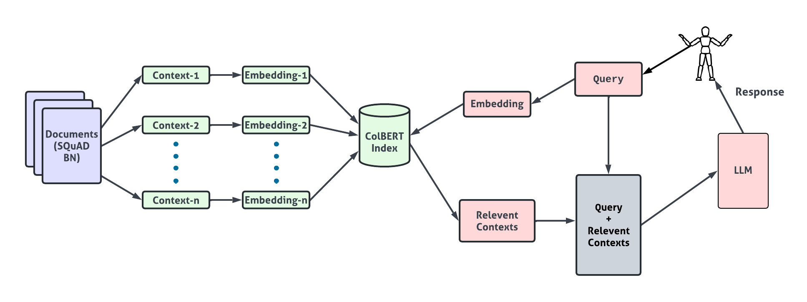

# BanglaRAG
## Description & Pipeline
Despite recent advancements in Large language
models (LLM), vast amounts of information exist beyond their
static knowledge base. Retrieval-Augmented Generation (RAG)
makes it possible for models to obtain and make use of the
most recent data, which is essential for fields that change
quickly, like science or current affairs. Unfortunately, there is
currently no effective RAG pipeline for the Bengali language.
Additionally, a reliable Bengali retriever is unavailable, and
there are no benchmarks for Bengali information retrieval.
add a image here

In this work, we extensively study retrieval performance in
Bengali with various established methods, e.g., representationbased similarity models and late interaction models. We finetune Contextualized Late Interaction over BERT (ColBERT)
and benchmark Bengali retrieval performance using SQuAD
BN dataset. We also incorporate our ColBERT retriever with
a Bengali LLM, BN-RAG-LLaMA3-8b, to produce a full RAG
pipeline and demonstrate the notable enhancement of 8% in the
LLM’s question-answering capabilities by comparing the LLM
with and without RAG.

## Our Works

1. First, we train the ColBERT retriever using various embedding models. You can find the code in ```train.py. ```

2. For benchmarking, we created two indexing. One is using only the embedding models and another is using our trained ColBERT model.
The codes can be found in ```indexing_test_without_colbert.ipynb``` and ```indexing_test.ipynb```. 

After benchmarking, we got the following results and chose our best model.

| Embedding Model Name                                  | Hit Rate@50 | MRR@50   |
|-------------------------------------------------------|-------------|----------|
| csebuetnlp/banglabert                                 | 0.520767    | 0.285596 |
| sagorsarker/bangla-bert-base                          | 0.632588    | 0.377902 |
| **l3cube-pune/bengali-sentence-similarity-sbert**         | **0.707268**    | **0.451116** |
| google-bert/bert-base-multilingual-cased              | 0.664537    | 0.414423 |
| FacebookAI/xlm-roberta-base                           | 0.496006    | 0.202986 |


3. We used LLM with and without our RAG model and got 8% improvement in F1 score.

| Model Name                                            | F1 Score  |
|-------------------------------------------------------|-------------|
|LLM without any RAG pipeline                           | 0.04  |
|LLM with our RAG pipeline                              | 0.12  |

